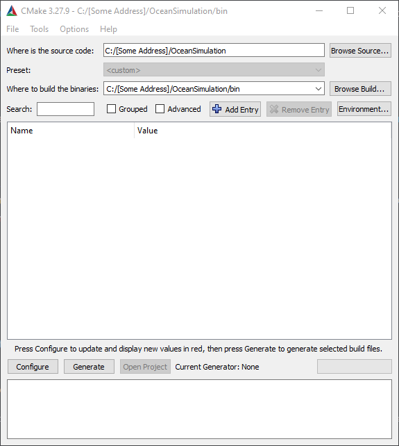

# Ocean Simulation
This program attempts to create a realistic lighting simulation of an ocean. 

## Getting Started With The Simulator
To get the simulator to work, you need to use [CMake](https://cmake.org/cmake/help/latest/manual/cmake-gui.1.html) to generate the code.

Set up file directories as you see in the image above (source code is in the root and build it in `./bin`) then complete the following steps
1. Hit `Configure`, choose the version of Visual Studio to use, then wait for the "Configuring done" message to pop up in the terminal
2. Select `Generate` and use the default values if prompted
3. Click on `Open Project` and use the default values if prompted
4. In Visual Studio, run the debugger (CMake will have created this for you!)
5. You now should have the simulation running on your machine (after it loads using the terminal)!

When running the simulator, you can move the camera by holding the `ALT` key and either the `W`, `A`, `S`, and `D` keys to move forward, left, right, and down or the arrow keys to change the camera's pitch. Feel free to alter the values in the menu to see how it effects the simulation. Keep in mind that the movement of the camera is only a 2D plane in parellel with the XZ plane, so to move in the Y direction you have to tilt the camera and then move forwards or backwards.

## Helpful Resources
To understand the equations we arrived to in creating this simulation, we used the following resource in developing this project:
- The [NVIDIA GPUGems book](https://developer.nvidia.com/gpugems/gpugems/part-i-natural-effects/chapter-1-effective-water-simulation-physical-models)
- Acerola's two part series on developing a water shader in Unity
    - Part 1 [video](https://www.youtube.com/watch?v=PH9q0HNBjT4)
    - Part 2 [video](https://www.youtube.com/watch?v=yPfagLeUa7k)
    - His [repository](https://github.com/GarrettGunnell/Water)

# Citations
We did not create our own skybox; we downloaded the hdr file from [this website](https://polyhaven.com/a/kloppenheim_06_puresky)

# License
MIT License

Copyright (c) 2023 Kristian Kolehmainen and Robert Kilkenny

Permission is hereby granted, free of charge, to any person obtaining a copy
of this software and associated documentation files (the "Software"), to deal
in the Software without restriction, including without limitation the rights
to use, copy, modify, merge, publish, distribute, sublicense, and/or sell
copies of the Software, and to permit persons to whom the Software is
furnished to do so, subject to the following conditions:

The above copyright notice and this permission notice shall be included in all
copies or substantial portions of the Software.

THE SOFTWARE IS PROVIDED "AS IS", WITHOUT WARRANTY OF ANY KIND, EXPRESS OR
IMPLIED, INCLUDING BUT NOT LIMITED TO THE WARRANTIES OF MERCHANTABILITY,
FITNESS FOR A PARTICULAR PURPOSE AND NONINFRINGEMENT. IN NO EVENT SHALL THE
AUTHORS OR COPYRIGHT HOLDERS BE LIABLE FOR ANY CLAIM, DAMAGES OR OTHER
LIABILITY, WHETHER IN AN ACTION OF CONTRACT, TORT OR OTHERWISE, ARISING FROM,
OUT OF OR IN CONNECTION WITH THE SOFTWARE OR THE USE OR OTHER DEALINGS IN THE
SOFTWARE.